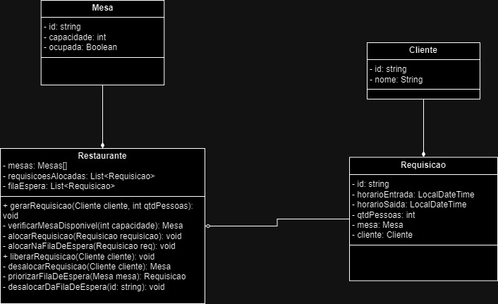
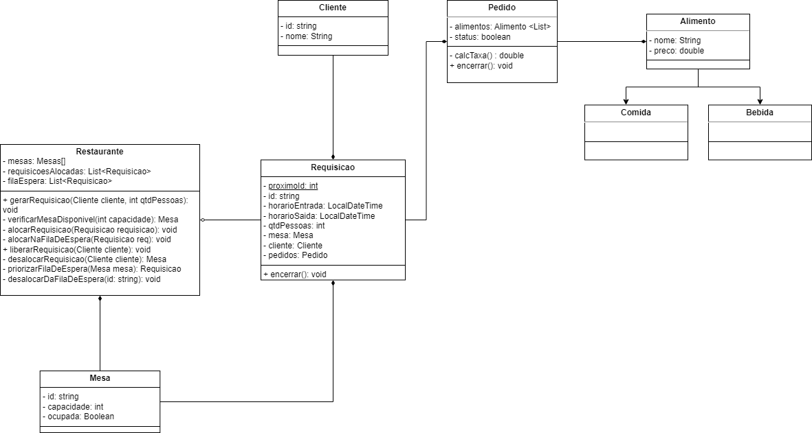
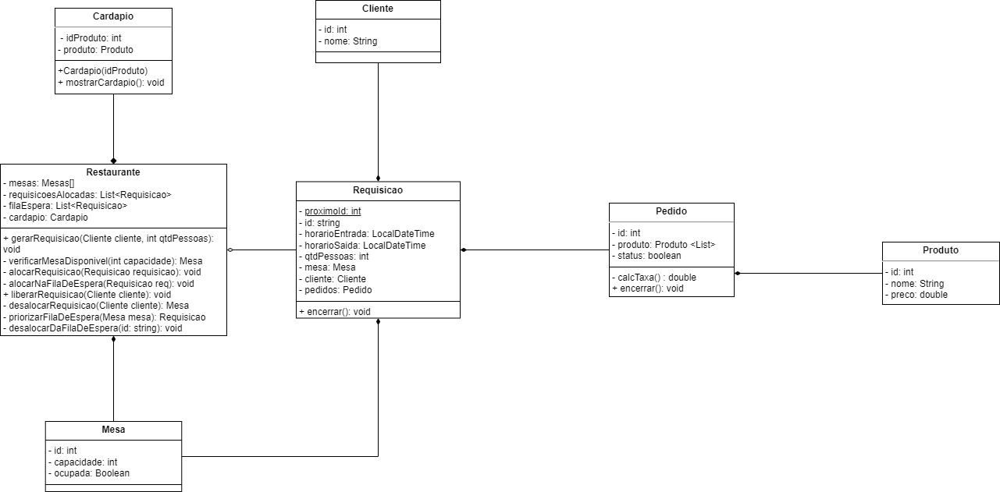
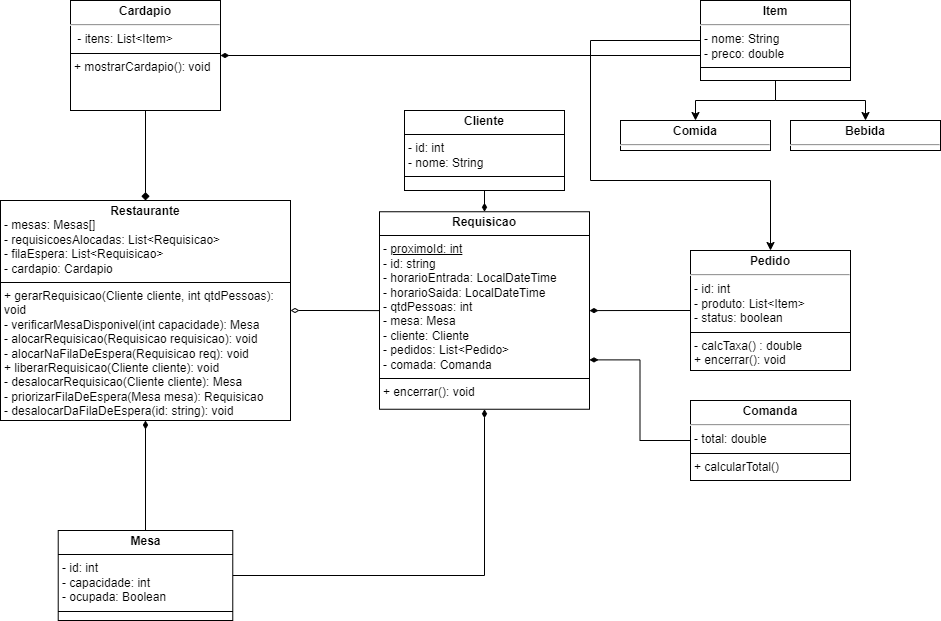
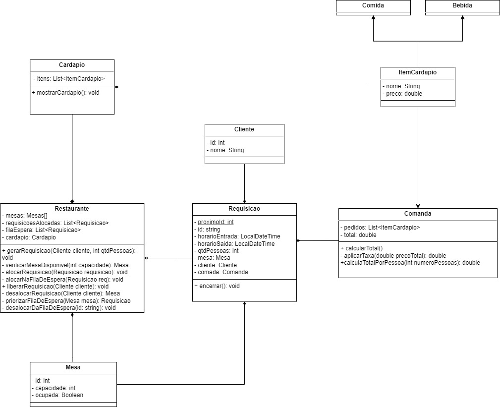

# Diagramas de classe
Coloque aqui todas as versões do seu diagrama de classes. Cada versão deve começar com um número de dois dígitos, na ordem crescente.

## Histórico de versões

* 0.0 - Versão Inicial

    
  
* 0.1 - Primeira versão

    
  
* 0.2 - Segunda versão

    
  
* 0.3 - Terceira versão

    
  
* 0.4 - Quarta versão

    
  
* 0.5 - Quinta versão

    
  

