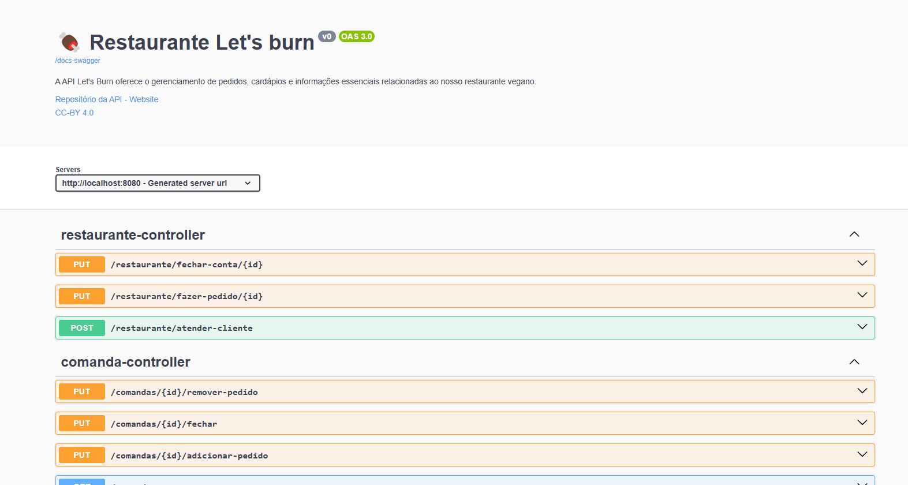

# Instruções de uso

## Configuração do Projeto

### Clonando o Repositório

```
git clone https://github.com/DisciplinasProgramacao/lpm-projeto2024-1-letsburn.git
````

### Mudar o usuario e a senha do banco de dados no application.properties

```
cd letsburn-api/src/main/resources/application.properties
```

### Rodar o Back-end

```
cd letsburn-api/src/main/java\com/api/letsburn_restaurante/LetsburnApiApplication.java
```

### Link para domentação do swagger:
http://localhost:8080/swagger-ui/index.html 
